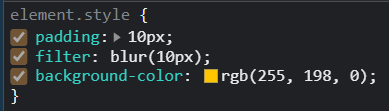
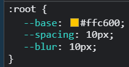
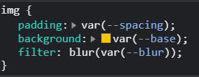
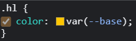

```js
    const spaceScroll = document.querySelector("#spacing")
    const blurScroll = document.querySelector("#blur")
    const palette = document.querySelector("#base")
    const img = document.querySelector("img")
    img.style.padding = `${spaceScroll.value}${spaceScroll.dataset.sizing}`
    img.style.filter = `blur(${blurScroll.value}${spaceScroll.dataset.sizing})`
    img.style.backgroundColor = `${palette.value}`


    spaceScroll.addEventListener("input", (event) => {
      const value = event.target.value
      img.style.padding = `${value}${spaceScroll.dataset.sizing}`
    })

    blurScroll.addEventListener("input", (event) => {
      const value = event.target.value
      img.style.filter = `blur(${value}${spaceScroll.dataset.sizing})`
    })

    palette.addEventListener("input", (event) => {
      const value = event.target.value
      img.style.backgroundColor = `${value}`
    })
```

```js
    const inputs = document.querySelectorAll('.controls input');

    function handleUpdate() {
      const suffix = this.dataset.sizing || '';
      document.documentElement.style.setProperty(`--${this.name}`, this.value + suffix);
    }

    inputs.forEach(input => input.addEventListener('change', handleUpdate));
    inputs.forEach(input => input.addEventListener('mousemove', handleUpdate));
```

## 비교

- ``querySelectorAll``를 이용해서 input요소를 모두 선택했다. 나는 일일히 하나씩 지정했는데  input 요소가 같은 클래스 네임을 가지고 있다면 훨씬 효과적일 것 같다.

- 나는 img 태그를 직접 선택해서 해당 요소에 스타일을 추가해줬는데, 아래 코드는 ``document.documentElement``로 html 태그에 스타일을 추가했다. 따라서 img 뿐만 아니라 span 태그도 해당 스타일을 상속 받았다.

  | 내가 만듦                                                    | 만들어져 있는 것                                             |
  | ------------------------------------------------------------ | ------------------------------------------------------------ |
  |  |  |
  |  | <br><br> |


## this를 사용

```js
 function handleUpdate() {
      const suffix = this.dataset.sizing || '';
      document.documentElement.style.setProperty(`--${this.name}`, this.value + suffix);
    }
```

this를 이용해서 콜백함수를 호출한 주체를 참조했다. 여기서 this는 해당 콜백함수를 호출한 input 요소일 것이다.

