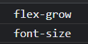

## toggle

```javascript
  <script>
    const targets = document.querySelectorAll(".panel")

    function toggleOpen() {
      this.classList.toggle('open');
    }
    function toggleActive(e) {
      console.log(e.propertyName)
      this.classList.toggle('open-active');
    }

    targets.forEach(element => element.addEventListener('click', toggleOpen))
    targets.forEach(element => element.addEventListener('transitionend', toggleActive))
  </script>
```

``transitionend`` 이벤트 발생시 ``open-active``를 클래스로 추가해준다.



하지만 여기서 2개의 ``transition``이 발생하는 것을 확인할 수 있는데, 이렇게 되면 ``transtionend`` 이벤트가 두 번 발생하게 되고 ``toggleActive``함수가 두번 호출되어 결국엔 클래스가 추가 되지 않는다. ``transition``이벤트를 하나로 줄이거나 3개로 늘리면 정상적으로 토글이 되는 것을 확인해서 위와 같이 판단했다.

```js
    function toggleActive(e) {
      if (Array.from(this.classList).includes('open'))
        this.classList.add('open-active');
      else this.classList.remove('open-active');
    }
```

``open`` 클래스가 추가된 뒤에 발생하는 이벤트 이기 때문에 해당 클래스 존재 여부로 ``add``,``revmoe`` 메서드를 추가해서 해결했다.